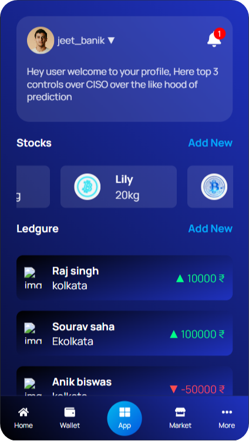

<table>
  <tr>
    <td>
      
    </td>
    <td>
      

        <strong>INC-TRACKER</strong> is a full-stack web application that helps users manage and track their income efficiently. Built with a React frontend and Node.js backend, it offers features like income categorization, visual charts, and daily tracking tools to help users stay on top of their finances.
      

    </td>
  </tr>
</table>
